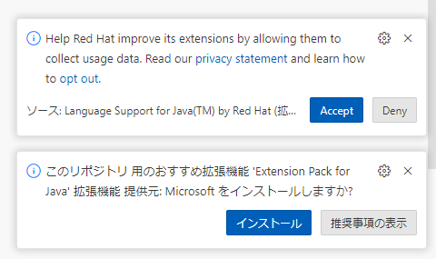

# 実習環境のセットアップ

本書ではJavaプログラミング演習用の環境設定方法を記述します。

## 前提条件

- インターネットに接続可能なWindowsPC
- 取得済みGitHubアカウント

## GitHub Codespaces Java Templateの導入

1) PCにログインし、Webブラウザを開きます。
2) Microsoft提供の[Java Templateリポジトリ](https://github.com/microsoft/vscode-remote-try-java)に接続します。
3) 右上緑の「Use this template」をクリックし、表示された「Open in a codespace」をクリックします。

   

4) codespaceのセットアップが開始されます。

   

5) セットアップが完了すると、VS Codeが表示されます。

   

## VS Codeの設定

1) 右下にいくつかポップアップが表示されます。それぞれ「Accept」「インストール」を押下します。

   

2) 左上Explorerボタンをクリックして、エクスプローラーを表示します。

   

3) .vscodeフォルダーをクリックし、さらにlaunch.jsonをクリックして、開きます。

   

4) 「console」を「integratedTerminal」に書き換えます。

   

5) キーボードの「ctrl」＋「s」を押下、または右上のメニューから「ファイル」「保存」をクリックして、保存します。

   

## 起動確認（Hello Remote World!）

1) 右側エクスプローラーでsrcフォルダー、main/java/com/mycompany/appフォルダー、App.javaの順にクリックし、ファイルを開きます。

   

2) 右上に表示されている「Run Java」ボタンをクリックします。

   

3) 右下にポップアップが表示されるので、「Yes」をクリックします。

   

4) 下部のターミナルに「Hello Remote World!」と表示されればセットアップが完了です。

   

## その他

TBD

停止手順、復帰手順、制限など
